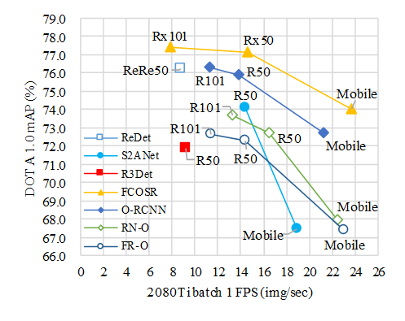

# FCOSR: A Simple Anchor-free Rotated Detector for Aerial Object Detection

> **[FCOSR: A Simple Anchor-free Rotated Detector for Aerial Object Detection](#)** 
> arXiv preprint ([arXiv:2111.10780](https://arxiv.org/abs/2111.10780)).

## 任务简述

使用FCOSR完成遥感影像旋转目标检测

## 阶段任务

1. 在Window系统跑通FCOSR的训练和评估脚本
2. 验证论文中FCOSR在DOTA1.0、DOTA1.5等数据集上的精度和推理速度
3. 测试FCOSR在DIOR-R数据集上的精度
4. 测试FCOSR在自定义数据集上（OBB方式标注的Sentinel-2影像数据，目标为渔业养殖等）的精度
5. 精度调优
6. 部署（Intel CPU或者Nvidia GPU）

## 旋转目标检测数据集

| 数据集    | 发布时间 | 类别数 | 图片总数 | 数据集划分比例 训练:验证:测试 | 图片分辨率        |
| --------- | -------- | ------ | -------- | --------------------------------- | ----------------- |
| [DOTA1.0] | 2018-01  | 15     | 2806     | 3:2:1                             | 800×800~2000×2000 |
| [DOTA1.5] | 2019-03  | 16     | 2806     | 3:2:1                             | 800×800~2000×2000 |
| [DOTA2.0] | 2021-02  | 18     | 11268    | 3:2:1                             | 800×800~2000×2000 |
| [DIOR-R]  | 2021-10  | 20     | 23463    | 1:1:2                             | 800×800           |

## 评价指标

1. 精度评价指标：mAP
2. 性能评价指标：FPS

